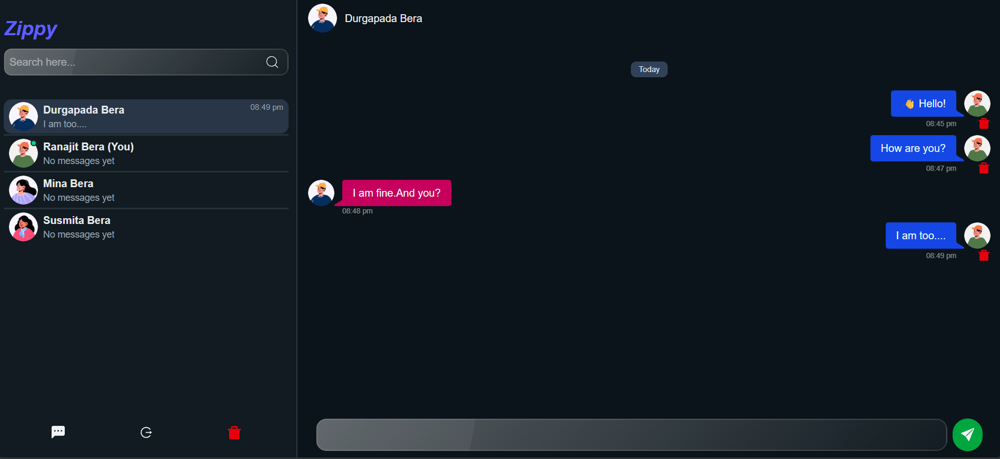

<div align="center">

  <!-- Project Header -->
  <h1>⚡ Zippy — Real-Time Chat App</h1>
  <p>A sleek, full-stack real-time messaging application built with the <strong>MERN Stack</strong>, <strong>Socket.io</strong>, and <strong>Zustand</strong>.</p>

  <!-- Badges -->
  <p>
    
    
    
    
    
    
  </p>

  <!-- Quick Action Buttons -->
  <p>
    <a href="https://zippy-4d46.onrender.com" target="_blank">
      
    </a>
    <a href="https://github.com/ranajitbera2006/Zippy-ChatApp" target="_blank">
      
    </a>
  </p>

  <!-- App Screenshot -->
  <br />
  
  <br />

</div>

---

## 🔗 Quick Access

| Resource | Link |
| :--- | :--- |
| **🚀 Live Application** | [https://zippy-4d46.onrender.com](https://zippy-4d46.onrender.com) |
| **📦 GitHub Repository** | [https://github.com/ranajitbera2006/Zippy-ChatApp](https://github.com/ranajitbera2006/Zippy-ChatApp) |

---

## ✨ Features

* ⚡ **Instant Real-Time Chat:** Low-latency bi-directional messaging powered by **Socket.io**.
* 🟢 **Online/Offline Tracking:** Live indicators showing user presence in real time.
* 🔐 **Secure Authentication:** JSON Web Tokens (JWT) stored in secure `HTTP-only` cookies with `bcryptjs` password hashing.
* 🐻 **State Management:** Fast and lightweight global client state management using **Zustand**.
* 🔍 **User Search & Sidebar:** Effortlessly discover, search, and initiate conversations with users.
* 💬 **Chat Persistence:** Full conversation history securely stored and queried from **MongoDB**.
* 📱 **Dark Mode UI:** Responsive, modern design with custom user avatars and chat bubbles.

---

## 🛠️ Tech Stack

### **Frontend**
* **React.js** (Vite)
* **Zustand** (Global state management)
* **Socket.io Client** (Real-time WebSocket events)
* **Tailwind CSS / Pure CSS** (Responsive dark theme styling)

### **Backend**
* **Node.js** & **Express.js (v5)** (REST APIs & Server routing)
* **Socket.io** (WebSocket server management & broadcast events)
* **MongoDB** & **Mongoose** (NoSQL Database & Object Modeling)
* **Cookie-Parser** & **JSON Web Tokens (JWT)** (Session authorization)
* **Bcrypt.js** (Password encryption)

---

## 📁 Project Structure

```text
Zippy-ChatApp/
├── backend/
│   ├── db/                 # Database connection (connect.js)
│   ├── models/             # Mongoose schemas (User, Message, Conversation)
│   ├── routes/             # Express API routes (auth, message, user)
│   ├── socket/             # Socket.io connection logic & event listeners
│   └── server.js           # Server entry point & static file serving
│
├── frontend/
│   ├── public/
│   ├── src/
│   │   ├── components/     # UI components (Sidebar, MessageContainer, MessageInput)
│   │   ├── zustand/        # Global state stores
│   │   ├── hooks/          # Custom hooks
│   │   ├── pages/          # Login, SignUp, Home pages
│   │   ├── App.jsx
│   │   └── main.jsx
│   ├── dist/               # Production frontend build
│   └── package.json
│
├── package.json            # Root monorepo configuration & build scripts
└── README.md